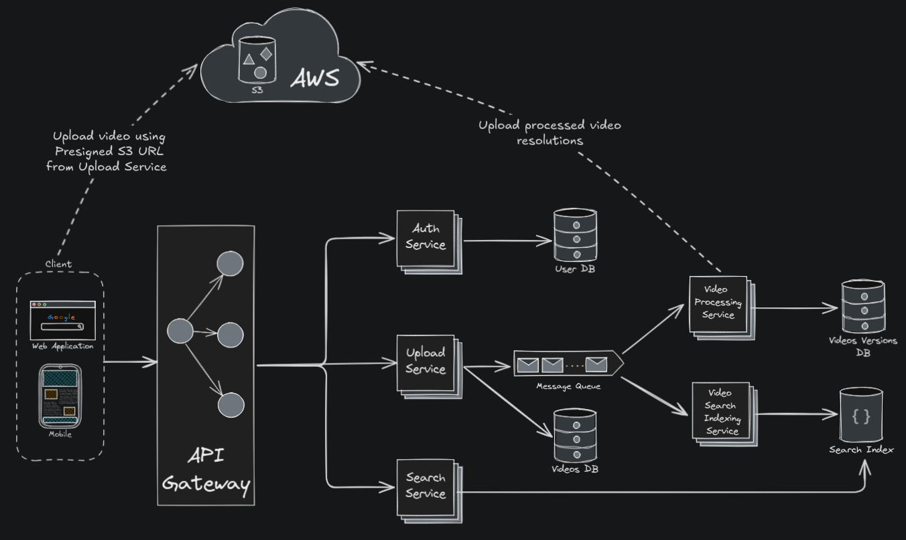

# Video Streaming Infrastructure

This project is a modular video streaming platform designed to replicate the high level architecture of websites like YouTube. It utilizes a microservices architecture to ensure scalability, and maintainability.


## Architecture Overview

The platform is built upon a **microservices architecture**, with distinct services handling specific functionalities. These services communicate asynchronously and are orchestrated for deployment.




### Directory Structure

- `backend/`
  - `auth-service/`: Handles user authentication and authorization.
  - `search-service/`: Provides video search functionality.
  - `upload-service/`: Manages video uploads.
  - `video-processing-service/`: Processes uploaded videos.
  - `video-search-index-processing-service/`: Updates search indices for videos.
- `frontend/`: Web client for user interaction.
- `initdb/`: Database initialization scripts.
- `compose.yml`: Docker Compose configuration for local development.
- `nginx.conf`: NGINX configuration.
- `.env`: Environment variables configuration.

### Core Services

* **Authentication Service**:
    * Manages user registration, login, and logout processes.
    * Implements JWT based authentication for secure access.
    * **Technologies**: Node.js, Express.js, PostgreSQL.
* **Upload Service**:
    * Handles video upload requests.
    * Generates secure AWS S3 presigned URLs for direct client side uploads.
    * Pushes video metadata to a Kafka topic for further processing by other services.
    * **Technologies**: Node.js, Express.js, PostgreSQL.
* **Video Processing Service**:
    * Consumes messages from Kafka regarding new video uploads.
    * Uses FFmpeg to transcode videos into various resolutions.
    * Uploads the processed video segments back to AWS S3.
    * Updates the PostgreSQL database with information about available video versions.
    * **Technologies**: Python, FFmpeg, Kafka, PostgreSQL.
* **Video Search Indexing Service**:
    * Listens for events (new video processed, metadata updated).
    * Maintains a real time search index of video metadata.
    * **Technologies**: Node.js, Elasticsearch.
* **Search Service**:
    * Provides an API endpoint for user search queries.
    * Queries the Elasticsearch index to retrieve relevant video results.
    * **Technologies**: Node.js, Express.js, Elasticsearch.
* **Frontend Web Client**: A frontend application which allows users to:
   * Browse available videos.
   * Search for specific videos.
   * Upload new videos.
   * **Technologies**: Typescript, React.js, React Router, Tailwind CSS, shadcn/ui.

### Supporting Infrastructure

* **API Gateway**:
    * NGINX is configured to act as an API Gateway.
    * Handles request routing to the appropriate microservices.
    * Provides load balancing across instances of services.
* **Containerization & Orchestration**:
    * Docker is used to containerize each microservice and its dependencies.
    * Docker Compose is utilized for managing the multi container application environment during development and deployment.
* **Data Storage**:
    * **PostgreSQL**: Primary relational database for storing user data, video and video versions metadata.
    * **AWS S3**: Object storage for raw uploaded videos and processed video versions.
    * **Elasticsearch**: Search engine for indexing and querying video metadata.
* **Message Broker**:
    * **Apache Kafka**: Used as a distributed messaging system for asynchronous communication between services.


## Getting Started

### Prerequisites

* Docker & Docker Compose
* AWS Account (for S3)

### Installation & Setup

1.  Clone the repository:
    ```bash
    git clone https://github.com/rajesh-sv/video-streaming-infra
    cd video-streaming-infro
    ```
2.  Configure environment variables in `.env`. Setting values for `REGION`, `AWS_ACCESS_KEY_ID`, `AWS_SECRET_ACCESS_KEY` and `S3_BUCKET` environment variables is **mandatory**.
3.  Build and run services using Docker Compose:
    ```bash
    docker compose up --build -d
    ```
4.  Access the frontend at `http://localhost:8080`.


## Future Improvements

* Enhanced fault tolerance & error handling.
* Implement CI/CD pipeline.
* Sharding and replication of database.
* Implement video chunking using AWS S3 multipart upload for faster uploads.
* Integrate CloudFront (or a similar CDN) to cache video content.
* Integrate a centralized logging solution.


## License

Distributed under the Apache License Version 2.0. See [LICENSE](./LICENSE) for more information.

